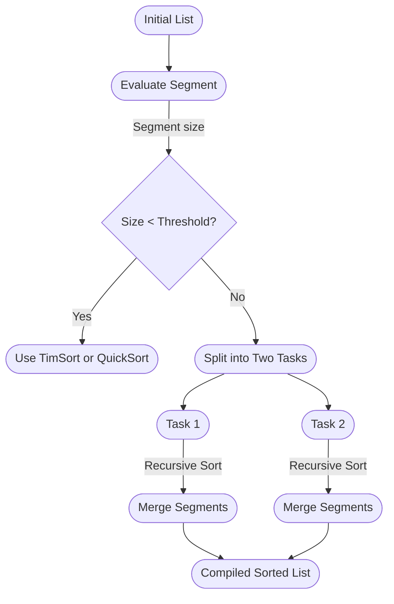

![[AdaptiveHybridSort.java]]

The Adaptive Hybrid Sort is a sophisticated Java-based sorting mechanism designed to efficiently handle large datasets by dynamically selecting the optimal sorting algorithm for current conditions. This approach integrates the robustness of TimSort and the quick operations of QuickSort, using dynamic runtime performance measures to decide between them. Below, we explore the unique aspects of this algorithm and discuss why it's particularly effective.

## Key Features and Benefits

### Parallel Execution with Fork/Join Framework

Utilizing Java's `ForkJoinPool` and `RecursiveAction`, the sort operation is executed in parallel. This means that large lists are divided into smaller segments that can be processed concurrently, leveraging multiple processors to reduce overall sort time significantly. This approach is especially advantageous when dealing with large-scale data.

### Dynamic Selection Between QuickSort and TimSort

Instead of statically relying on a single sorting technique, Adaptive Hybrid Sort chooses between QuickSort and TimSort at runtime based on ongoing performance metrics. This selection is made using the following criteria:

- **Performance Metrics**: The algorithm maintains performance data such as the average time and variance of sorting times for both QuickSort and TimSort.
- **Decision Making**: For each segment, if the segment size is below a predefined threshold, the algorithm decides which sorting method to use based on the accumulated performance data. This ensures that the most efficient algorithm is used for particular data conditions, improving performance adaptively.

### Adaptive Threshold Adjustment

A critical aspect of Adaptive Hybrid Sort is its ability to adjust the threshold dynamically, which determines whether a task will be processed in parallel or handled sequentially.

- **Threshold Metrics**: During execution, the sort tasks collect performance data on small and large tasks.
- **Optimal Resource Utilization**: By comparing these metrics, the system can increase or decrease the threshold to balance the workload effectively across multiple processors, optimizing resource utilization.

## Example Usage

Suppose we have the following list of integers:

```java
List<Integer> data = Arrays.asList(8, 3, 5, 9, 1, 10, 4);
AdaptiveHybridSort.parallelSort(data);
```

This code snippet triggers the sorting of the data list using the Adaptive Hybrid Sort's parallel capabilities.

## Process Overview

The general process flow of the Adaptive Hybrid Sort algorithm is outlined below:




At each step, the algorithm evaluates the segment of the list it is working with. If the segment size is below the threshold, it will use either TimSort or QuickSort, depending on which is performing better at runtime. For larger segments, it divides the task into two smaller tasks, processing them recursively in parallel.

## Conclusion

The Adaptive Hybrid Sort algorithm offers a highly efficient and adaptive approach to sorting large datasets. By dynamically selecting the optimal algorithm and adjusting workload thresholds based on real-time performance metrics, it ensures fast, efficient, and scalable sorting, making it a suitable choice for modern multi-core processing environments.